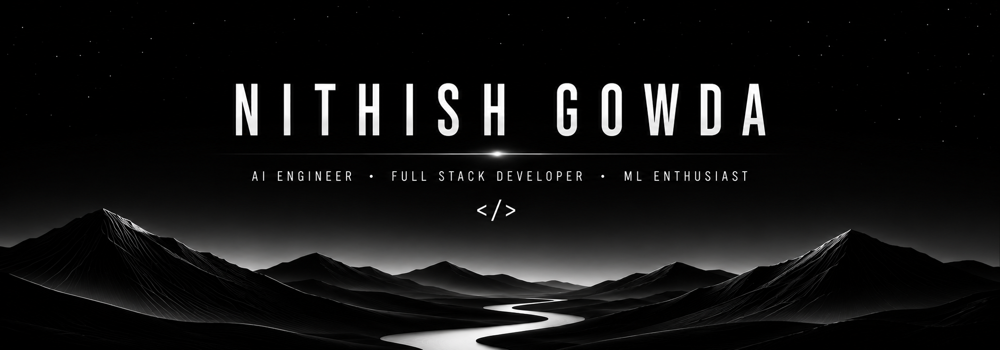
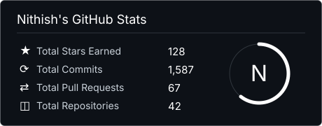

<!-- BANNER -->

<!-- CONTACT BUTTONS -->

  
  
  
  
  

 
<!-- ABOUT -->

  <h3 style="font-size:24px;font-weight:700;color:#ffffff;margin:0 0 0 0;">About Me</h3>

I teach machines to do the impossible — just to see if they can. I've made AI argue back, read faces, predict the sun's mood swings, and turned a model into an IEEE paper while I was at it. I've also made contracts sign themselves on the blockchain. If a problem looks unsolvable, that's my favourite kind. Powered by espresso, wired by default.

<!-- TECHNOLOGIES -->

  <h3 style="font-size:24px;font-weight:700;color:#ffffff;margin:0;">Technologies</h3>

  
AI, Machine Learning &amp; Data

  TensorFlow / Keras
  PyTorch
  OpenCV
  PostgreSQL

  
Languages &amp; Web Development

  Python
  Next.js
  Node.js
  Express
  Flask

  
Databases, DevOps &amp; Blockchain

  MySQL
  Docker
  Solidity
  Ethers.js
  Pandas &amp; NumPy
  Git &amp; GitHub

<!-- PROJECTS -->

  <h3 style="font-size:24px;font-weight:700;color:#ffffff;margin:0;">Projects</h3>

Featured Projects

  <table style="width:100%;max-width:940px;margin:16px auto 0 auto;border-collapse:collapse;color:#ffffff;background:#000000;">
    <thead>
      <tr>
        <th style="text-align:left;font-size:11.5px;font-weight:700;letter-spacing:1px;color:#ffffff;padding:10px 16px 10px 0;width:32%;border-bottom:1px solid #ffffff;">PROJECT</th>
        <th style="text-align:left;font-size:11.5px;font-weight:700;letter-spacing:1px;color:#ffffff;padding:10px 16px;width:34%;border-bottom:1px solid #ffffff;">TECH STACK</th>
        <th style="text-align:left;font-size:11.5px;font-weight:700;letter-spacing:1px;color:#ffffff;padding:10px 16px;width:34%;border-bottom:1px solid #ffffff;">KEY IMPACTS</th>
      </tr>
    </thead>
    <tbody>
      <tr>
        <td style="padding:14px 16px 14px 0;font-size:15.5px;font-weight:600;border-bottom:1px solid #ffffff;">Digital Contract Platform </td>
        <td style="padding:14px 16px;font-size:14px;font-weight:500;color:#c9d1d9;border-bottom:1px solid #ffffff;">Next.js · Express · Python</td>
        <td style="padding:14px 16px;font-size:13.5px;font-weight:500;color:#c9d1d9;border-bottom:1px solid #ffffff;">AI legal-risk · on-chain verification · gRPC</td>
      </tr>
      <tr>
        <td style="padding:14px 16px 14px 0;font-size:15.5px;font-weight:600;border-bottom:1px solid #ffffff;"><a href="https://github.com/nghn0/AI-Based-Silk-Fabric-Type-Texture-Classification-E-Commerce-Website" target="_blank" style="color:#ffffff;text-decoration:none;">Loomera </a></td>
        <td style="padding:14px 16px;font-size:14px;font-weight:500;color:#c9d1d9;border-bottom:1px solid #ffffff;">TensorFlow · MobileNetV2 · Flask</td>
        <td style="padding:14px 16px;font-size:13.5px;font-weight:500;color:#c9d1d9;border-bottom:1px solid #ffffff;">92%+ accuracy · Grad-CAM XAI · smart recs</td>
      </tr>
      <tr>
        <td style="padding:14px 16px 14px 0;font-size:15.5px;font-weight:600;border-bottom:1px solid #ffffff;"><a href="https://github.com/nghn0/AI-Powered-Resume-Builder" target="_blank" style="color:#ffffff;text-decoration:none;">AI Resume Builder </a></td>
        <td style="padding:14px 16px;font-size:14px;font-weight:500;color:#c9d1d9;border-bottom:1px solid #ffffff;">Node.js · Express · MongoDB</td>
        <td style="padding:14px 16px;font-size:13.5px;font-weight:500;color:#c9d1d9;border-bottom:1px solid #ffffff;">Prompt → ATS-ready PDF</td>
      </tr>
      <tr>
        <td style="padding:14px 16px 14px 0;font-size:15.5px;font-weight:600;border-bottom:1px solid #ffffff;"><a href="https://github.com/nghn0/Sentient-NPC" target="_blank" style="color:#ffffff;text-decoration:none;">Sentient NPC </a></td>
        <td style="padding:14px 16px;font-size:14px;font-weight:500;color:#c9d1d9;border-bottom:1px solid #ffffff;">Python · Transformer · Vosk</td>
        <td style="padding:14px 16px;font-size:13.5px;font-weight:500;color:#c9d1d9;border-bottom:1px solid #ffffff;">Fully offline · sub-245ms latency</td>
      </tr>
    </tbody>
  </table>

  

    More Projects
  

  

    <table style="width:100%;max-width:940px;margin:0 auto;border-collapse:collapse;color:#ffffff;background:#000000;">
      <thead>
        <tr>
          <th style="text-align:left;font-size:11.5px;font-weight:700;letter-spacing:1px;color:#ffffff;padding:10px 16px 10px 0;width:32%;border-bottom:1px solid #ffffff;">PROJECT</th>
          <th style="text-align:left;font-size:11.5px;font-weight:700;letter-spacing:1px;color:#ffffff;padding:10px 16px;width:34%;border-bottom:1px solid #ffffff;">TECH STACK</th>
          <th style="text-align:left;font-size:11.5px;font-weight:700;letter-spacing:1px;color:#ffffff;padding:10px 16px;width:34%;border-bottom:1px solid #ffffff;">KEY IMPACTS</th>
        </tr>
      </thead>
      <tbody>
        <tr>
          <td style="padding:14px 16px 14px 0;font-size:15.5px;font-weight:600;border-bottom:1px solid #ffffff;"><a href="https://github.com/nghn0/SolarCycle-analysis_and_prediction" target="_blank" style="color:#ffffff;text-decoration:none;">SolarCycle Analysis </a></td>
          <td style="padding:14px 16px;font-size:14px;font-weight:500;color:#c9d1d9;border-bottom:1px solid #ffffff;">LSTM · TensorFlow · Pandas · NumPy</td>
          <td style="padding:14px 16px;font-size:13.5px;font-weight:500;color:#c9d1d9;border-bottom:1px solid #ffffff;">SSN forecast · LSTM MAE 13.29</td>
        </tr>
        <tr>
          <td style="padding:14px 16px 14px 0;font-size:15.5px;font-weight:600;border-bottom:1px solid #ffffff;"><a href="https://github.com/nghn0/Emojify" target="_blank" style="color:#ffffff;text-decoration:none;">Emojify </a></td>
          <td style="padding:14px 16px;font-size:14px;font-weight:500;color:#c9d1d9;border-bottom:1px solid #ffffff;">TensorFlow · Keras · OpenCV · CNN · ViT</td>
          <td style="padding:14px 16px;font-size:13.5px;font-weight:500;color:#c9d1d9;border-bottom:1px solid #ffffff;">Real-time emotion · 3 architectures · XAI</td>
        </tr>
        <tr>
          <td style="padding:14px 16px 14px 0;font-size:15.5px;font-weight:600;border-bottom:1px solid #ffffff;"><a href="https://github.com/nghn0/qr_code_detection" target="_blank" style="color:#ffffff;text-decoration:none;">QR Code Detection </a></td>
          <td style="padding:14px 16px;font-size:14px;font-weight:500;color:#c9d1d9;border-bottom:1px solid #ffffff;">YOLOv8 · Ultralytics · Label Studio · OpenCV</td>
          <td style="padding:14px 16px;font-size:13.5px;font-weight:500;color:#c9d1d9;border-bottom:1px solid #ffffff;">50-epoch training · JSON outputs</td>
        </tr>
        <tr>
          <td style="padding:14px 16px 14px 0;font-size:15.5px;font-weight:600;border-bottom:1px solid #ffffff;"><a href="https://github.com/nghn0/mcpserver" target="_blank" style="color:#ffffff;text-decoration:none;">MCP Server </a></td>
          <td style="padding:14px 16px;font-size:14px;font-weight:500;color:#c9d1d9;border-bottom:1px solid #ffffff;">FastMCP · Docker · Gemini · JSON-RPC</td>
          <td style="padding:14px 16px;font-size:13.5px;font-weight:500;color:#c9d1d9;border-bottom:1px solid #ffffff;">Multi-domain routing · severity scoring</td>
        </tr>
        <tr>
          <td style="padding:14px 16px 14px 0;font-size:15.5px;font-weight:600;border-bottom:1px solid #ffffff;"><a href="https://github.com/nghn0/RFID_smart_locking_system" target="_blank" style="color:#ffffff;text-decoration:none;">Smart Lock System </a></td>
          <td style="padding:14px 16px;font-size:14px;font-weight:500;color:#c9d1d9;border-bottom:1px solid #ffffff;">NodeMCU ESP8266 · MFRC522 · PHP · MySQL</td>
          <td style="padding:14px 16px;font-size:13.5px;font-weight:500;color:#c9d1d9;border-bottom:1px solid #ffffff;">RFID auth · remote logging · IoT</td>
        </tr>
        <tr>
          <td style="padding:14px 16px 14px 0;font-size:15.5px;font-weight:600;border-bottom:1px solid #ffffff;"><a href="https://github.com/nghn0/Sky_View" target="_blank" style="color:#ffffff;text-decoration:none;">Sky View </a></td>
          <td style="padding:14px 16px;font-size:14px;font-weight:500;color:#c9d1d9;border-bottom:1px solid #ffffff;">Flask · WeatherAPI · SQLite</td>
          <td style="padding:14px 16px;font-size:13.5px;font-weight:500;color:#c9d1d9;border-bottom:1px solid #ffffff;">Real-time weather · saved cities</td>
        </tr>
      </tbody>
    </table>
  

<!-- STATISTICS -->

  <h3 style="font-size:24px;font-weight:700;color:#ffffff;margin:0 0 24px 0;">Statistics</h3>
  

